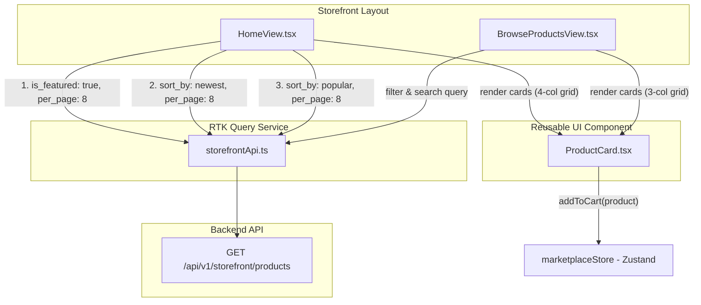

# Storefront Homepage Multi-Section Product Expansion Plan

## 1. Executive Summary & Goal Capsule
**Mục tiêu**: Cải tiến giao diện Trang chủ (`web/src/views/storefront/HomeView.tsx`) để tăng tỷ lệ chuyển đổi, kích thích khám phá và trình bày đa dạng sản phẩm hơn. Thay vì chỉ hiển thị 1 danh sách 6 sản phẩm nổi bật cố định, trang chủ được tái cấu trúc thành nhiều khối chuyên biệt phục vụ các nhu cầu khám phá khác nhau của người mua (Featured/Trending, New Arrivals, Best Sellers), với layout lưới 4 cột hiện đại (compact cards) và tái sử dụng component `ProductCard`.

**Điểm nhấn thiết kế & tính năng cốt lõi**:
1. **Component hóa `ProductCard` dùng chung**:
   - Tách logic hiển thị thẻ sản phẩm ra component độc lập `web/src/components/marketplace/ProductCard.tsx` để đồng bộ phong cách UI giữa HomeView, BrowseProductsView và các trang tương lai.
   - Thẻ sản phẩm đầy đủ thông tin: Thumbnail hover zoom, Product Type Badge (Downloadable, License Key, Bundle), Version tag, Vendor store link & avatar/name, Star rating, Price & Sale price, nút Quick "Add to Cart" với visual feedback.
2. **Cấu trúc lại Trang chủ thành 3 Section sản phẩm chuyên biệt**:
   - **Section 1 - Trending & Featured Assets**: Hiển thị top sản phẩm được gắn cờ nổi bật (`is_featured: true, per_page: 8`). Kèm header ấn tượng có badge "Trending Now", mô tả ngắn và CTA "Explore all featured".
   - **Section 2 - Fresh Releases / New Arrivals**: Hiển thị các sản phẩm mới nhất vừa đăng bán (`sort_by: 'newest', per_page: 8`). Giúp khách hàng quay lại luôn thấy nội dung mới.
   - **Section 3 - Best Sellers & Highest Rated**: Hiển thị các sản phẩm có lượt mua cao và đánh giá tốt nhất (`sort_by: 'popular', per_page: 8`). Tăng tính bảo chứng xã hội (Social Proof).
3. **Mật độ hiển thị tối ưu (Responsive 4-column Grid)**:
   - Sử dụng CSS grid `grid-cols-1 sm:grid-cols-2 md:grid-cols-3 lg:grid-cols-4 gap-5` để hiển thị 8 sản phẩm mỗi section (tổng cộng 24+ sản phẩm trên trang chủ) mà vẫn thoáng và đẹp mắt.
   - Skeleton loading states mượt mà và Empty states thân thiện cho từng section độc lập.

**Product Contract preservation**: Product Contract unchanged.

---

## 2. User Roles & Scope Boundaries

### User Roles & Actors
- **Guest / Unauthenticated Buyer**: Có thể duyệt các section sản phẩm trên trang chủ, xem thông tin nhanh, thêm vào giỏ hàng ngay lập tức hoặc nhấn vào xem chi tiết sản phẩm.
- **Authenticated Buyer**: Trải nghiệm tương tự với giỏ hàng được đồng bộ và các liên kết chuyển hướng tức thì.

### In Scope
1. **Component `ProductCard`**:
   - `web/src/components/marketplace/ProductCard.tsx` [NEW]: Component hiển thị thẻ sản phẩm tái sử dụng cho toàn bộ storefront.
2. **Trang chủ `HomeView`**:
   - `web/src/views/storefront/HomeView.tsx` [MODIFY]:
     - Giữ nguyên Hero Section và Category Pills Bar.
     - Thêm Section "Trending & Featured Products" (8 items).
     - Thêm Section "New Arrivals / Fresh Releases" (8 items).
     - Thêm Section "Top Rated & Best Sellers" (8 items).
     - Mỗi section có header riêng, visual icon, link "View all" điều hướng sang `/browse?sort_by=...` tương ứng, và grid 4 cột.
     - Skeleton loading state riêng biệt cho từng section với `useGetStorefrontProductsQuery`.
3. **Đồng bộ `BrowseProductsView`**:
   - `web/src/views/storefront/BrowseProductsView.tsx` [MODIFY]: Sử dụng component `ProductCard` dùng chung để đảm bảo tính nhất quán toàn diện trên toàn ứng dụng storefront.

### Out of Scope / Deferred to Follow-Up Work
- Chỉnh sửa backend API (API `/api/v1/storefront/products` đã hỗ trợ đầy đủ `is_featured`, `sort_by=newest`, `sort_by=popular`, `sort_by=rating`, `per_page`).
- Sửa đổi logic giỏ hàng hoặc luồng checkout.
- Phân trang infinite scroll trên trang chủ (giữ gọn mỗi section tối đa 8 sản phẩm và link "View all" sang Browse page).

---

## 3. High-Level Technical Design & Key Technical Decisions

### Architecture & Data Flow



### Key Technical Decisions (KTDs)

- **KTD1: Component hóa `ProductCard` độc lập**
  - *Quyết định*: Tạo `web/src/components/marketplace/ProductCard.tsx` nhận props `{ product: Product, showVendor?: boolean }`.
  - *Lý do*: Đảm bảo DRY, dễ bảo trì và đồng bộ trải nghiệm người dùng giữa HomeView, BrowseProductsView và Related Products trong tương lai.
- **KTD2: Thực hiện 3 API query song song độc lập trong `HomeView`**
  - *Quyết định*: Khai báo 3 hooks `useGetStorefrontProductsQuery` với các bộ tham số khác nhau:
    1. Featured: `{ is_featured: true, per_page: 8 }`
    2. Newest: `{ sort_by: 'newest', per_page: 8 }`
    3. Popular: `{ sort_by: 'popular', per_page: 8 }`
  - *Lý do*: RTK Query tự động tối ưu cache và fetch song song không gây blocking; mỗi section tự quản lý trạng thái loading skeleton và empty riêng biệt.
- **KTD3: Lưới Responsive 4 cột tối ưu hiển thị**
  - *Quyết định*: Sử dụng Tailwind CSS classes `grid grid-cols-1 sm:grid-cols-2 md:grid-cols-3 lg:grid-cols-4 gap-5`.
  - *Lý do*: Hiển thị được nhiều sản phẩm trên 1 viewport desktop (8 sản phẩm trong 2 hàng) mà thẻ card vẫn đủ không gian hiển thị thumbnail, giá và thông tin vendor.

---

## 4. Implementation Units

### U1. Reusable ProductCard Component
- **Goal**: Xây dựng component `ProductCard` dùng chung hoàn chỉnh, hỗ trợ thumbnail, badges, vendor name, rating, giá (kèm sale price), nút quick Add to Cart và link chi tiết.
- **Requirements**: R1 (Component hóa thẻ sản phẩm)
- **Dependencies**: Không
- **Files**:
  - `web/src/components/marketplace/ProductCard.tsx` [NEW]
- **Approach**:
  1. Tạo file `ProductCard.tsx` xuất interface `ProductCardProps { product: Product }`.
  2. Sử dụng `useMarketplaceStore` để lấy action `addToCart`.
  3. Render thumbnail 16:9 với placeholder fallback khi thiếu ảnh, hover zoom transition.
  4. Render badges loại sản phẩm (`downloadable_file`, `license_key`, `bundle`) và phiên bản version.
  5. Render thông tin vendor và điểm rating sao trung bình.
  6. Render giá bán (`effective_price` hoặc `price`) kèm giá gốc gạch ngang nếu có `sale_price`.
  7. Render nút "Add to Cart" có hiệu ứng hover & shadow, nút icon ArrowRight liên kết tới `/products/${product.slug}`.
- **Patterns to follow**: `web/src/views/storefront/BrowseProductsView.tsx` product card layout.
- **Test scenarios**:
  - *Happy path*: Render đúng tên, giá, vendor, thumbnail của product.
  - *Sale price*: Hiển thị giá khuyến mãi nổi bật và giá gốc gạch ngang.
  - *Missing thumbnail*: Hiển thị icon placeholder `Layers` trang nhã.
  - *Action*: Click "Add to Cart" gọi `addToCart(product)` mà không reload trang.
- **Verification**: Component render đúng định dạng và tương tác tốt khi truyền mock hoặc real product object.

### U2. Multi-Section Layout & Data Fetching in HomeView
- **Goal**: Tái cấu trúc `HomeView.tsx` với 3 section sản phẩm chuyên biệt (Featured, New Arrivals, Best Sellers) sử dụng lưới 4 cột và skeleton loader độc lập.
- **Requirements**: R2 (Trang chủ 3 Section sản phẩm chuyên biệt), R3 (Lưới 4 cột responsive)
- **Dependencies**: U1
- **Files**:
  - `web/src/views/storefront/HomeView.tsx` [MODIFY]
- **Approach**:
  1. Gọi 3 hook queries:
     - `featuredQuery = useGetStorefrontProductsQuery({ is_featured: true, per_page: 8 })`
     - `newestQuery = useGetStorefrontProductsQuery({ sort_by: 'newest', per_page: 8 })`
     - `popularQuery = useGetStorefrontProductsQuery({ sort_by: 'popular', per_page: 8 })`
  2. Xây dựng component con nội bộ `ProductSection` hoặc render 3 section riêng biệt với Header gồm Icon + Tagline + Tiêu đề + Nút "View all" liên kết sang `/browse` kèm query params.
  3. Render skeleton loader 4 cột tương ứng trong lúc `isLoading`.
  4. Render danh sách sản phẩm bằng component `ProductCard` (từ U1) với CSS grid `grid-cols-1 sm:grid-cols-2 md:grid-cols-3 lg:grid-cols-4 gap-5`.
  5. Xử lý Empty state nhẹ nhàng nếu danh sách rỗng.
- **Patterns to follow**: Cấu trúc Section hiện có trong `HomeView.tsx`.
- **Test scenarios**:
  - *Section 1*: Hiển thị tối đa 8 sản phẩm Featured; nút "Explore all" link tới `/browse?featured=true`.
  - *Section 2*: Hiển thị tối đa 8 sản phẩm mới nhất; nút "View all" link tới `/browse?sort_by=newest`.
  - *Section 3*: Hiển thị tối đa 8 sản phẩm bán chạy/đánh giá cao; nút "View all" link tới `/browse?sort_by=popular`.
  - *Loading states*: Mỗi section hiển thị skeleton loader riêng khi đang tải.
- **Verification**: Mở trang chủ trên trình duyệt, quan sát 3 section hiển thị đầy đủ, layout lưới 4 cột cân đối, responsive mượt mà trên mobile/tablet/desktop.

### U3. Harmonize BrowseProductsView with Reusable ProductCard
- **Goal**: Cập nhật `BrowseProductsView.tsx` sử dụng component `ProductCard` dùng chung để đảm bảo tính đồng bộ mã nguồn và giao diện.
- **Requirements**: R1 (Tính nhất quán giao diện toàn hệ thống)
- **Dependencies**: U1
- **Files**:
  - `web/src/views/storefront/BrowseProductsView.tsx` [MODIFY]
- **Approach**:
  1. Import `ProductCard` từ `../../components/marketplace/ProductCard`.
  2. Thay thế toàn bộ khối JSX rendering product card inline cũ bằng `<ProductCard key={product.id} product={product} />`.
  3. Giữ nguyên layout grid 3 cột trên Browse page (hoặc tuỳ chỉnh responsive phù hợp với sidebar filters).
- **Patterns to follow**: `web/src/components/marketplace/ProductCard.tsx`.
- **Test scenarios**:
  - Danh sách sản phẩm trên trang `/browse` hiển thị đồng bộ giao diện với trang chủ.
  - Các thao tác lọc, tìm kiếm, sắp xếp và thêm vào giỏ hàng hoạt động chính xác.
- **Verification**: Kiểm tra trang `/browse`, xác nhận component `ProductCard` hoạt động mượt mà không có lỗi runtime.

---

## 5. Verification Plan & Definition of Done

### Automated & Manual Verification Plan
1. **Kiểm tra TypeScript & Linter**:
   - Chạy kiểm tra TypeScript build cho web frontend:
     ```bash
     cd web && npm run build
     ```
2. **Kiểm tra hiển thị giao diện (Manual / Browser)**:
   - **Trang chủ (`/`)**:
     - Hero Section & Category Pills hiển thị đúng.
     - Section 1: "Featured & Trending Assets" hiển thị danh sách 8 sản phẩm nổi bật.
     - Section 2: "New Arrivals / Fresh Releases" hiển thị danh sách 8 sản phẩm mới nhất.
     - Section 3: "Top Rated & Best Sellers" hiển thị danh sách 8 sản phẩm có lượt xem/đánh giá cao.
     - Kiểm tra giao diện trên các kích thước màn hình: Mobile (< 640px), Tablet (768px), Desktop (1280px+).
   - **Trang duyệt sản phẩm (`/browse`)**:
     - Thẻ sản phẩm đồng bộ với `ProductCard`.
   - **Thao tác giỏ hàng**:
     - Thêm sản phẩm từ bất kỳ card nào trên trang chủ -> badge số lượng trên Navbar tăng lên tương ứng.

### Definition of Done
- [ ] Component `web/src/components/marketplace/ProductCard.tsx` được tạo mới và hoạt động độc lập.
- [ ] `HomeView.tsx` được cập nhật với 3 sections độc lập, hiển thị tối đa 24 sản phẩm với lưới 4 cột.
- [ ] `BrowseProductsView.tsx` được refactor sử dụng component `ProductCard`.
- [ ] Không có lỗi biên dịch TypeScript (`npm run build` thành công).
- [ ] Trải nghiệm UI hiện đại, responsive mượt mà và không phát sinh lỗi console.
